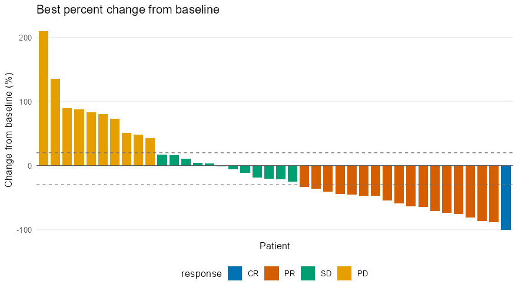
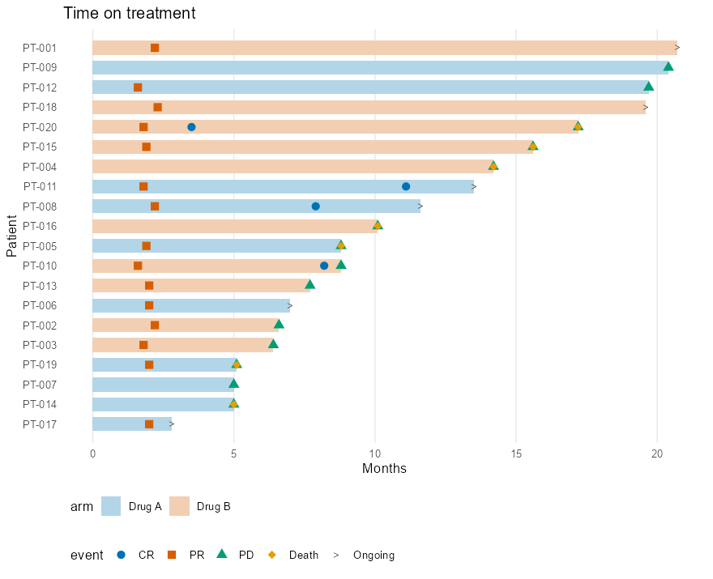

# floaties

<!-- badges: start -->
[](https://lifecycle.r-lib.org/articles/stages.html#experimental)
<!-- badges: end -->

floaties creates **waterfall** and **swimlane** plots for medical and clinical
data review. You choose the graphics engine: **ggplot2** for static,
publication-ready figures, or **plotly** or **echarts4r** for interactive
widgets in reports and Shiny apps.

floaties works with any data standard. It doesn't expect SDTM, ADaM, or any
particular variable names. You pass a data frame and point floaties to the
columns it needs using tidy evaluation. If your data has the right structure,
floaties plots it.

> floaties is in early development, so the API may still change.

## Installation

Install the development version from GitHub:

``` r
# install.packages("pak")
pak::pak("vedhav/floaties")
```

## Waterfall plot

Shows one bar per subject, sorted by value. A typical use is the best percent
change from baseline in tumor size, colored by best overall response, with
dashed reference lines at +20% and -30% (RECIST 1.1).

**Data structure:** one row per subject, with a subject identifier column and a
numeric value column. An optional `fill` column colors the bars, and
`tooltip` adds extra columns to the hover text in interactive engines.
floaties doesn't derive the value for you: filter or summarize your data to
one row per subject first.

``` r
library(floaties)

plot_waterfall(
  tumor_change,
  subject = patient,
  value = best_change,
  fill = response
)
```



Switch engines with one argument:

``` r
plot_waterfall(tumor_change, patient, best_change, fill = response, engine = "plotly")
plot_waterfall(tumor_change, patient, best_change, fill = response, engine = "echarts4r")
```

### With ADaM data

The same function works with ADaM data. Column `label` attributes are used as
default axis titles.

``` r
library(dplyr)

best_change <- pharmaverseadam::adtr_onco |>
  filter(PARAMCD == "SDIAM", !is.na(PCHG)) |>
  slice_min(PCHG, n = 1, with_ties = FALSE, by = USUBJID)

bor <- pharmaverseadam::adrs_onco |>
  filter(PARAMCD == "BOR") |>
  select(USUBJID, AVALC)

best_change |>
  left_join(bor, by = "USUBJID") |>
  mutate(AVALC = factor(AVALC, levels = c("CR", "PR", "SD", "PD", "NE"))) |>
  plot_waterfall(subject = USUBJID, value = PCHG, fill = AVALC)
```

### Checking the data behind a plot

`prep_waterfall()` takes the same arguments and returns the exact data the plot
is drawn from (sorted, with fill levels and colors resolved), which helps with
QC:

``` r
prep_waterfall(tumor_change, subject = patient, value = best_change)
```

## Swimlane plot

Shows one horizontal lane per subject, for example time on treatment, with
markers for events such as responses, progression, or death. Lanes for
subjects who are still ongoing end with an "Ongoing" arrow marker.

**Data structure:** two data frames.

- `data` has one row per subject, with a subject identifier and a numeric end
  time. Optional columns give the start time (default 0), a `fill` color, and
  an `ongoing` flag (logical, or `"Y"`/`"N"`).
- `events` (optional) has any number of rows per subject, with the subject
  identifier, a numeric event time, and the event type. The event type sets
  both marker shape and color.

All times must be numeric and in the same unit.

``` r
plot_swimlane(
  treatment_duration,
  subject = patient,
  end = months,
  fill = arm,
  ongoing = ongoing,
  events = response_events,
  event_time = month,
  event = event
)
```



Use `event_colors` and `event_shapes` to set the marker for each event type.
Shapes are `"circle"`, `"square"`, `"triangle"`, `"diamond"`, `"cross"`,
`"star"`, and `"arrow"`, and look the same in every engine:

``` r
plot_swimlane(
  treatment_duration, patient, months,
  ongoing = ongoing,
  events = response_events, event_time = month, event = event,
  event_shapes = c(CR = "star", PR = "triangle", PD = "square", Death = "cross"),
  engine = "plotly"
)
```

### With ADaM data

``` r
library(dplyr)

response <- pharmaverseadam::adrs_onco |>
  filter(PARAMCD == "OVR") |>
  mutate(ADY = as.numeric(ADT - TRTSDT) + 1)

pharmaverseadam::adsl |>
  filter(USUBJID %in% response$USUBJID, !is.na(TRTDURD)) |>
  plot_swimlane(
    subject = USUBJID,
    end = TRTDURD,
    fill = TRT01A,
    events = response,
    event_time = ADY,
    event = AVALC
  )
```

`prep_swimlane()` returns the prepared lanes and events for QC, like
`prep_waterfall()`.

## Engines

Every `plot_*()` function returns the engine's own object (a `ggplot`, or a
plotly or echarts4r htmlwidget), so you can keep customizing it with that
engine's tools, and use it in R Markdown, Quarto, or Shiny.

## License

MIT © Vedha Viyash
